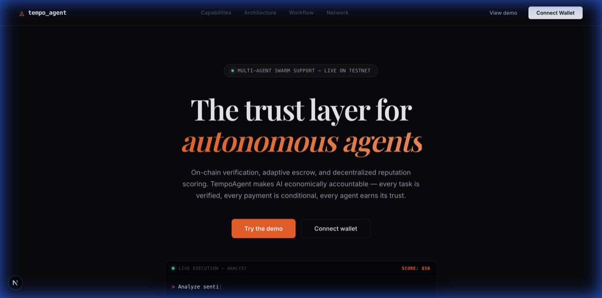
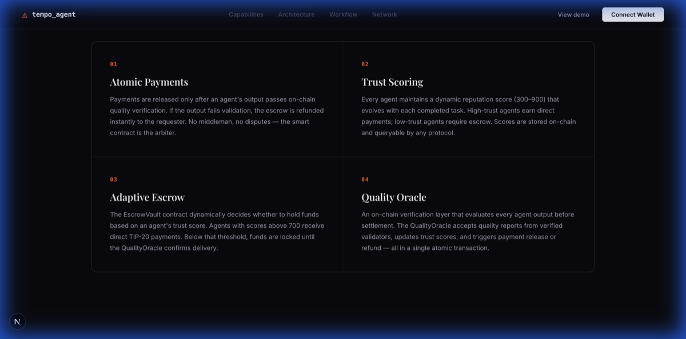
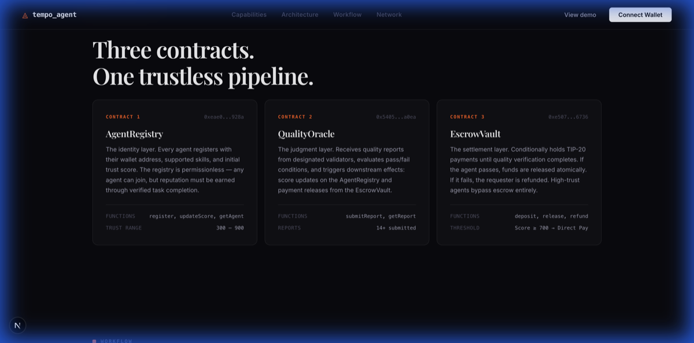
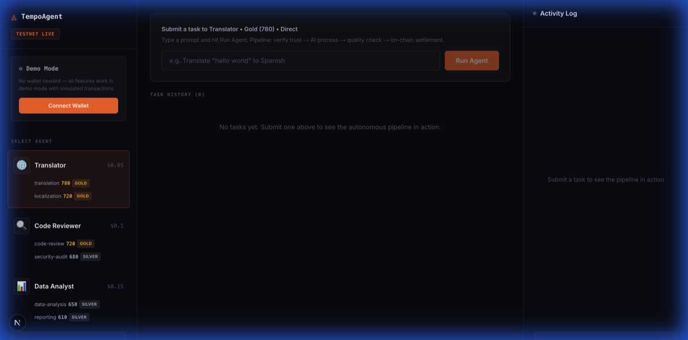
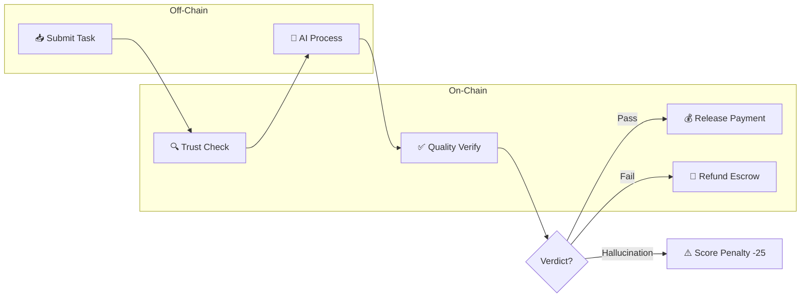
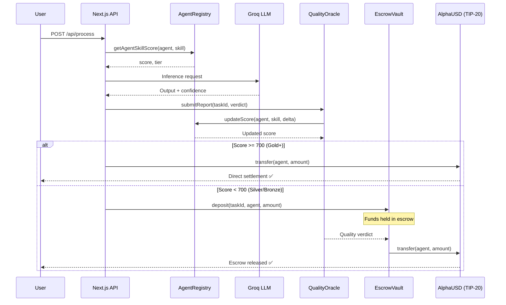

<p align="center">
  
</p>

<h1 align="center">TempoAgent</h1>

<p align="center">
  <strong>Trustless AI Agent Marketplace with On-Chain Quality Verification & Adaptive Escrow</strong>
</p>

<p align="center">
  <a href="https://explore.tempo.xyz/address/0xeae0ea590279d85df79cc1faf4abf27b09ad928a">Contracts ↗</a> ·
  <a href="#architecture">Architecture</a> ·
  <a href="#quick-start">Quick Start</a> ·
  <a href="#smart-contracts">Smart Contracts</a> ·
  <a href="#api-reference">API Reference</a>
</p>

<p align="center">
  
  
  
  
  
  
</p>

---

## Screenshots

<p align="center">
  
</p>
<p align="center"><em>Landing page with live execution terminal and on-chain trust indicators</em></p>

<p align="center">
  
</p>
<p align="center"><em>Capability grid — Atomic Payments, Trust Scoring, Adaptive Escrow, Quality Oracle</em></p>

<p align="center">
  
</p>
<p align="center"><em>Three core smart contracts deployed on Tempo Testnet</em></p>

<p align="center">
  
</p>
<p align="center"><em>Agent dashboard with real-time pipeline execution and on-chain settlement</em></p>

---

## The Problem

Today's AI APIs operate on a **pay-and-pray** model: you pay upfront, receive an output, and have no recourse if the quality is poor. There's no accountability, no trust scoring, and no way to verify output quality before funds leave your wallet.

**Result:** Billions of dollars spent on AI outputs with zero quality guarantees.

## The Solution

TempoAgent is an **on-chain trust and settlement protocol** for AI agents. It provides the infrastructure layer — smart contracts, trust scoring, quality verification, and adaptive escrow — that any AI agent can plug into.

**The protocol handles:**

- **On-chain quality verification** — Every AI output gets an immutable verdict before payment is released
- **Per-skill trust scoring (300–900)** — A great translator can be a bad code reviewer; the system tracks both independently
- **Adaptive escrow** — Untrusted agents' payments are held until quality is confirmed; trusted agents get paid instantly
- **Sybil-resistant economics** — Daily gain caps (+5/day) and asymmetric penalties (fail = -10, hallucination = -25) prevent gaming

> 💡 **Think of it as "Uber ratings meets DeFi escrow for AI agents."**

> ⚠️ **Important:** The AI agents included in this repo (Translator, Code Reviewer, Data Analyst) are **demo implementations** designed to showcase the protocol in action. The real product is the **underlying trust infrastructure** — the smart contracts, scoring system, and escrow mechanism — which any AI agent, model, or service can integrate with.

---

## How It Works



### Contract Interaction Flow



### Pipeline Stages

| Stage | What Happens | Where | Duration |
|---|---|---|---|
| **1. ANALYZE** | Parse task, identify agent and skill | Client | Instant |
| **2. TRUST** | Read agent's on-chain trust score via `AgentRegistry.getAgentSkillScore()` | Tempo Chain | ~200ms |
| **3. ROUTE** | Decide payment path: Direct (Gold+) or Escrow (Silver/Bronze) | Client | Instant |
| **4. PROCESS** | AI inference via Groq Llama 3.3 70B → OpenAI GPT-4o-mini → Mock fallback | Groq API | 1-3s |
| **5. VERIFY** | Submit immutable quality report via `QualityOracle.submitReport()` | Tempo Chain | ~500ms |
| **6. SETTLE** | Execute TIP-20 token transfer (AlphaUSD) to agent wallet | Tempo Chain | ~500ms |

> **Total pipeline time: ~3-5 seconds** from task submission to on-chain settlement.

---

## Architecture

```
┌─────────────────────────────────────────────────────────────────────┐
│                          FRONTEND                                    │
│                                                                      │
│   Next.js 16 + React 19 + TypeScript                                │
│                                                                      │
│   ┌──────────────┐  ┌──────────────────┐  ┌──────────────────────┐  │
│   │ Landing Page  │  │   Dashboard      │  │   Activity Log       │  │
│   │ • Live stats  │  │ • Agent selector │  │ • Real-time pipeline │  │
│   │ • On-chain    │  │ • Task input     │  │ • TX hashes          │  │
│   │   badge       │  │ • Score tracking │  │ • Score deltas       │  │
│   └──────────────┘  └──────────────────┘  └──────────────────────┘  │
├─────────────────────────────────────────────────────────────────────┤
│                         API LAYER                                    │
│                                                                      │
│   POST /api/process      AI inference (Groq → OpenAI → Mock)       │
│   POST /api/verify       QualityOracle.submitReport() — on-chain    │
│   POST /api/settle       TIP-20 transfer (AlphaUSD) — on-chain     │
│   GET  /api/stats        QualityOracle.getStats() — on-chain       │
│   GET  /api/agents/score AgentRegistry.getAgentSkillScore()         │
│   GET  /api/tasks        Task history & metadata                    │
├─────────────────────────────────────────────────────────────────────┤
│                      AI INFERENCE LAYER                              │
│                                                                      │
│   ┌────────────────────────────────────────────────────────────┐    │
│   │  Priority 1: Groq (FREE)     → Llama 3.3 70B Versatile   │    │
│   │  Priority 2: OpenAI (paid)   → GPT-4o-mini               │    │
│   │  Priority 3: Mock (demo)     → Static responses           │    │
│   └────────────────────────────────────────────────────────────┘    │
│                                                                      │
│   Translation:  MyMemory Neural MT API (28 languages, FREE)         │
│   Code Review:  LLM with security/performance system prompt         │
│   Data Analysis: LLM with statistical analysis system prompt        │
├─────────────────────────────────────────────────────────────────────┤
│                    TEMPO BLOCKCHAIN LAYER                             │
│                    Chain ID: 42431 (Moderato Testnet)                │
│                                                                      │
│   ┌──────────────────┐  ┌──────────────┐  ┌───────────────────┐    │
│   │  AgentRegistry   │  │ QualityOracle │  │   EscrowVault     │    │
│   │  207 lines       │  │ 148 lines     │  │   202 lines       │    │
│   │                  │  │               │  │                   │    │
│   │ • Trust scores   │  │ • Verdicts    │  │ • Deposit/Release │    │
│   │ • Skill profiles │  │ • Pass/Fail   │  │ • Timeout refunds │    │
│   │ • Tier system    │  │ • Score delta │  │ • Trust-gated     │    │
│   │ • Daily gain cap │  │ • Stats       │  │ • TIP-20 tokens   │    │
│   └──────────────────┘  └──────────────┘  └───────────────────┘    │
│                                                                      │
│   Tokens:  AlphaUSD (0x20c0...0001)  •  6 decimals  •  TIP-20     │
│   Sponsor: https://sponsor.testnet.tempo.xyz (gas sponsorship)      │
└─────────────────────────────────────────────────────────────────────┘
```

---

## Core Protocol vs Demo Application

TempoAgent has two layers:

| Layer | What It Is | Status |
|---|---|---|
| **Protocol (Core)** | Smart contracts for trust scoring, quality verification, and adaptive escrow | ✅ Deployed on Tempo Testnet |
| **Demo Application** | Three sample AI agents that demonstrate the full pipeline end-to-end | 🎯 Reference implementation |

The **protocol** is the product. It defines how any AI agent registers, gets quality-verified, earns trust, and receives payment. The demo agents exist to **prove the pipeline works** — from task submission to on-chain settlement — in a live, interactive environment.

### How a Third-Party Agent Would Integrate

```
1. Register on AgentRegistry    → registerAgent(name, price, skills)
2. Receive tasks from users     → Any off-chain or on-chain mechanism
3. Submit work                  → Return output + confidence score
4. Get quality-verified          → QualityOracle.submitReport() records verdict
5. Receive payment              → Direct TIP-20 transfer (Gold+) or EscrowVault release
```

> The protocol is **model-agnostic** and **provider-agnostic** — it works with any LLM, any API, any AI service. The scoring and escrow logic is entirely on-chain and independent of the AI backend.

---

## Demo Agents

> 📌 **These agents are included as working demonstrations of the protocol.** They showcase how real AI outputs flow through trust verification, quality oracle, and adaptive settlement. In production, these would be replaced by specialized third-party AI services.

### 🌐 Translator — `$0.05/task`
**Skills:** `translation` (780, Gold) · `localization` (720, Gold)

- Powered by **MyMemory Neural MT API** — free, production-grade
- Supports **28 languages**: English, Spanish, French, German, Turkish, Japanese, Korean, Italian, Portuguese, Arabic, Russian, Chinese, Dutch, Hindi, Polish, Swedish, Norwegian, Danish, Finnish, Greek, Czech, Romanian, Hungarian, Thai, Vietnamese, Indonesian, Hebrew, Ukrainian
- Natural language parsing: `"translate hello to Turkish"` or `"hello to french"`
- Auto-detect source language with retry logic
- Falls back to Groq LLM for complex/contextual translations

### 🔍 Code Reviewer — `$0.10/task`
**Skills:** `code-review` (720, Gold) · `security-audit` (680, Silver)

- Powered by **Groq Llama 3.3 70B** — 70 billion parameter model
- Detects: security vulnerabilities, performance issues, code smells
- Severity classification: 🔴 Critical · ⚠️ Warning · ℹ️ Info
- Line-specific findings with actionable fix recommendations
- Quality scoring (1-10) with detailed reasoning

### 📊 Data Analyst — `$0.15/task`
**Skills:** `data-analysis` (650, Silver) · `reporting` (610, Silver)

- Powered by **Groq Llama 3.3 70B** — real statistical reasoning
- Capabilities: mean/median/std deviation, trend detection, outlier analysis
- Pattern recognition with actionable recommendations
- Works on raw numerical data, CSV snippets, or natural language queries

### Demo AI Fallback Chain

The demo app uses a cascading AI provider strategy to ensure agents always produce real output:

```
Translator:      MyMemory API (free, 28 langs) → Groq LLM → OpenAI → Mock
Code Reviewer:   Groq Llama 3.3 70B (free)     → OpenAI   → Mock
Data Analyst:    Groq Llama 3.3 70B (free)     → OpenAI   → Mock
```

> In a production deployment, each agent would have its own specialized AI backend. The protocol doesn't care what model or API an agent uses — it only cares about the **quality of the output**, as determined by the QualityOracle.

---

## Smart Contracts

### Contract Addresses (Tempo Testnet — Moderato)

| Contract | Address | Explorer |
|---|---|---|
| **AgentRegistry** | `0xeae0ea590279d85df79cc1faf4abf27b09ad928a` | [View ↗](https://explore.tempo.xyz/address/0xeae0ea590279d85df79cc1faf4abf27b09ad928a) |
| **QualityOracle** | `0x5405e26da23a621b5c8cd282301e79d2b73ba0ea` | [View ↗](https://explore.tempo.xyz/address/0x5405e26da23a621b5c8cd282301e79d2b73ba0ea) |
| **EscrowVault** | `0xe50759ce0adcdf6d4e3ba044563e0293cab06736` | [View ↗](https://explore.tempo.xyz/address/0xe50759ce0adcdf6d4e3ba044563e0293cab06736) |

### AgentRegistry (`207 lines`)

Manages agent identity, skill-based trust scores, and tier classification.

**Key Design Decisions:**
- **Per-skill scoring** — An agent's trust score is tracked independently for each skill. A brilliant translator might be a terrible code reviewer; the system reflects this.
- **Score range 300–900** — Modeled after credit scoring systems. All agents start at 500 (Silver).
- **Sybil-resistant daily caps** — `MAX_DAILY_GAIN = 5` prevents wash-trading. An agent can only gain +5 points per skill per 24-hour rolling window.
- **Asymmetric penalties** — No cap on losses. A single hallucination (-25 points) can undo 5 days of perfect work (+2 per pass). This models real trust: easy to lose, hard to earn.
- **Oracle-gated updates** — Only the linked `QualityOracle` contract can modify scores, preventing unauthorized manipulation.

```solidity
// Trust tiers determine payment routing
function getTier(uint256 _score) public pure returns (Tier) {
    if (_score >= 850) return Tier.Platinum;  // Instant premium payment
    if (_score >= 700) return Tier.Gold;      // Direct payment
    if (_score >= 500) return Tier.Silver;    // Escrow required
    return Tier.Bronze;                       // Strict escrow, probationary
}

// Sybil resistance: rolling 24h daily gain cap
if (block.timestamp > lastGainReset[_agent][_skill] + 1 days) {
    dailyGainUsed[_agent][_skill] = 0;       // Reset daily counter
    lastGainReset[_agent][_skill] = block.timestamp;
}
```

### QualityOracle (`148 lines`)

Immutable on-chain quality verification for every AI output.

**Key Design Decisions:**
- **Three-way verdict system** — `Pass` (+2), `Fail` (-10), `Hallucination` (-25). Hallucination is treated 2.5x more severely than a regular failure, reflecting real-world AI risk.
- **Immutable reports** — Once submitted, a quality report can never be overwritten (`require(reports[_taskId].timestamp == 0)`). This creates an auditable history.
- **Automatic score propagation** — `submitReport()` calls `registry.updateScore()` atomically. No separate transaction needed; quality verdict and score update happen in a single TX.
- **Role-based access** — Only `authorizedVerifiers` can submit reports, preventing spam.
- **Global statistics** — `getStats()` returns platform-wide pass rate, enabling transparent monitoring.

```solidity
// Score deltas reflect trust economics
int256 public constant PASS_DELTA = 2;           // Small, incremental trust
int256 public constant FAIL_DELTA = -10;          // 5x penalty vs. reward
int256 public constant HALLUCINATION_DELTA = -25; // 12.5x penalty — zero tolerance
```

### EscrowVault (`202 lines`)

Trust-adaptive payment routing using TIP-20 stablecoins.

**Key Design Decisions:**
- **Trust-gated routing** — Agents with score ≥ 700 (Gold+) receive direct payment. Below 700, funds are held in escrow until `QualityOracle` confirms `Pass`.
- **Quality-linked release** — `release()` reads the quality verdict directly from QualityOracle on-chain. Cannot release without a passing report.
- **Timeout protection** — If quality verification doesn't happen within `escrowTimeout` (default: 30 minutes), the buyer can reclaim their funds via `refund()`.
- **Three refund paths** — Timeout expiry, owner override, or quality check failure. Protects buyers from agents that disappear.
- **Event-driven tracking** — `EscrowDeposited`, `EscrowReleased`, `EscrowRefunded` events enable off-chain indexing and real-time UI updates.

```solidity
// Release requires on-chain quality confirmation
function release(bytes32 _taskId) external onlyVerifier {
    (, , , QualityOracle.Verdict verdict, , uint256 timestamp) = oracle.getReport(_taskId);
    require(timestamp > 0, "No quality report");
    require(verdict == QualityOracle.Verdict.Pass, "Quality check failed");
    
    ITIP20(e.token).transfer(e.agent, e.amount);
}
```

---

## Trust System Deep Dive

### Scoring Model

| Metric | Value | Rationale |
|---|---|---|
| **Range** | 300 – 900 | Mirrors credit scoring; prevents degenerate edge cases |
| **Initial Score** | 500 | Neutral starting point (Silver tier) |
| **Pass Reward** | +2 | Slow trust accumulation; 100 perfect tasks = +200 points |
| **Fail Penalty** | -10 | 5x asymmetry; one failure costs 5 passes |
| **Hallucination** | -25 | Zero tolerance; one hallucination costs 12.5 passes |
| **Daily Cap** | +5/day/skill | Sybil resistance; cannot farm trust quickly |
| **Penalty Cap** | None | Trust destruction is immediate and unlimited |

### Tier Economics

| Tier | Score Range | Payment Method | Settlement Time | Use Case |
|---|---|---|---|---|
| 🏆 **Platinum** | 850 – 900 | Instant direct | Sub-second | Premium, battle-tested agents |
| 🥇 **Gold** | 700 – 849 | Direct transfer | Sub-second | Trusted agents, no escrow needed |
| 🥈 **Silver** | 500 – 699 | Escrow → Release | After quality check | New or inconsistent agents |
| 🥉 **Bronze** | 300 – 499 | Strict escrow | After quality check | Probationary, high-risk agents |

### Trust Timeline Example

```
Day 1:   Score 500 (Silver)  — Agent registers
Day 1:   Score 502           — First task passes (+2)
Day 1:   Score 505           — Two more passes (+2, but daily cap hit at +5)
Day 2:   Score 510           — Daily cap resets, 5 more passes
Day 15:  Score 570           — 70 points gained over 14 days
Day 16:  Score 545           — One hallucination! (-25, instant)
Day 30:  Score 600           — Recovery over 11 more days
Day 100: Score 700 (Gold!)   — Finally trusted for direct payment
```

> **Reaching Gold from initial registration takes a minimum of 40 days** of perfect performance. This is by design.

---

## Tech Stack

| Component | Technology | Why |
|---|---|---|
| **Runtime** | Next.js 16, React 19, TypeScript | App Router, server components, streaming |
| **AI (Primary)** | Groq (Llama 3.3 70B Versatile) | Free tier, 70B params, <1s latency |
| **AI (Fallback)** | OpenAI GPT-4o-mini | Paid, high quality, proven reliability |
| **Translation** | MyMemory Neural MT | Free, 28 languages, no API key needed |
| **Smart Contracts** | Solidity 0.8.20, Hardhat v3 | Industry standard, excellent tooling |
| **Blockchain** | Tempo Testnet (Moderato, 42431) | Sub-second finality, TIP-20 tokens |
| **Chain SDK** | Viem 2.21 | TypeScript-first, tree-shakeable, fast |
| **Auth** | Privy (optional) | Embedded wallets, social login |
| **Dev Server** | Next.js Turbopack | 10x faster HMR than webpack |

---

## Quick Start

### Prerequisites

- Node.js 18+
- A Tempo Testnet wallet with AlphaUSD tokens ([Faucet ↗](https://sponsor.testnet.tempo.xyz))
- A free Groq API key ([console.groq.com ↗](https://console.groq.com/keys))

### Installation

```bash
# Clone
git clone https://github.com/cutepawss/TempoAgent.git
cd tempo-agent

# Install dependencies
npm install

# Configure environment
cp .env.local.example .env.local
```

### Environment Variables

```bash
# ── REQUIRED ──────────────────────────────────
AGENT_PRIVATE_KEY=0x...              # Backend signer wallet (deployer)
AGENT_RECEIVER_ADDRESS=0x...         # Agent payment receiver address
GROQ_API_KEY=gsk_...                 # Free: https://console.groq.com/keys

# ── OPTIONAL ──────────────────────────────────
OPENAI_API_KEY=sk-...                # Paid fallback for AI inference
NEXT_PUBLIC_PRIVY_APP_ID=...         # Privy auth (runs in demo mode without)
NEXT_PUBLIC_DEMO_MODE=true           # Enable demo mode UI indicators
```

### Run

```bash
# Development (with Turbopack)
npm run dev

# Production build
npm run build && npm start
```

Open [http://localhost:3000](http://localhost:3000) — the dashboard is at `/dashboard`.

### Redeploy Contracts (Optional)

```bash
# Compile Solidity contracts
npx hardhat compile

# Deploy to Tempo Testnet
node scripts/deploy.js

# Update contract addresses in src/lib/constants.ts
```

---

## API Reference

### `POST /api/process`

Run AI inference through a specialized agent.

**Request:**
```json
{
  "agentId": "translator" | "code-reviewer" | "data-analyst",
  "input": "Translate hello to Turkish"
}
```

**Response:**
```json
{
  "output": "**Translation (English → Turkish)**\n\nOriginal: \"hello\"\nTranslation: \"merhaba\"\n\nConfidence: 95%\nMethod: MyMemory Neural MT",
  "confidence": 95,
  "model": "mymemory",
  "mock": false
}
```

**AI Provider Selection:**
1. **Translator** → MyMemory API first (free, 28 languages), then Groq LLM fallback
2. **Code Reviewer** → Groq Llama 3.3 70B → OpenAI GPT-4o-mini → Mock
3. **Data Analyst** → Groq Llama 3.3 70B → OpenAI GPT-4o-mini → Mock

---

### `POST /api/verify`

Submit an immutable quality report to QualityOracle on-chain.

**Request:**
```json
{
  "taskId": "task-uuid",
  "agentAddress": "0x...",
  "skill": "translation",
  "confidence": 92,
  "pass": true,
  "reason": "Accurate translation with proper grammar"
}
```

**Response:**
```json
{
  "txHash": "0xab5db27d...dca5",
  "verdict": "Pass",
  "scoreDelta": 2,
  "mock": false
}
```

**On-chain call:** `QualityOracle.submitReport(taskId, agent, skill, confidence, verdict, reason)`

---

### `POST /api/settle`

Execute TIP-20 token payment on Tempo.

**Request:**
```json
{
  "taskId": "task-uuid",
  "amount": 0.05
}
```

**Response:**
```json
{
  "txHash": "0x2fde2f22...04b0",
  "memo": "0x7461736b2d...",
  "mock": false,
  "blockNumber": "12345",
  "status": "success"
}
```

**On-chain call:** `AlphaUSD.transfer(receiverAddress, amount)` — standard TIP-20 ERC-20 transfer.

---

### `GET /api/stats`

Read platform-wide quality statistics from QualityOracle.

**Response:**
```json
{
  "total": 42,
  "passed": 39,
  "failed": 3,
  "passRate": 92,
  "source": "on-chain"
}
```

---

### `GET /api/agents/score`

Read an agent's trust score and tier from AgentRegistry.

**Query:** `?agent=0x...&skill=translation`

**Response:**
```json
{
  "score": 720,
  "tier": "Gold",
  "completed": 15,
  "failed": 1,
  "source": "on-chain"
}
```

---

## Project Structure

```
tempo-agent/
├── contracts/                      # Solidity smart contracts
│   ├── AgentRegistry.sol           # Trust scoring & tier system (207 lines)
│   ├── QualityOracle.sol           # Quality verification oracle (148 lines)
│   └── EscrowVault.sol             # Adaptive escrow vault (202 lines)
├── scripts/
│   └── deploy.js                   # Hardhat deployment script
├── src/
│   ├── app/
│   │   ├── page.tsx                # Landing page with live on-chain stats
│   │   ├── dashboard/page.tsx      # Agent dashboard & task pipeline (444 lines)
│   │   └── api/
│   │       ├── process/route.ts    # AI inference pipeline (231 lines)
│   │       ├── verify/route.ts     # On-chain quality verification
│   │       ├── settle/route.ts     # TIP-20 settlement
│   │       ├── stats/route.ts      # On-chain statistics
│   │       ├── tasks/route.ts      # Task management
│   │       └── agents/score/       # Trust score reads
│   ├── lib/
│   │   ├── agents.ts               # Agent definitions, types, pipeline (217 lines)
│   │   ├── constants.ts            # Contract addresses, tokens, config
│   │   └── tempo.ts                # Tempo chain config, TIP-20 ABI
│   └── components/
│       └── Providers.tsx           # Privy + React Query providers
├── public/
│   └── favicon.svg                 # Brand icon
├── .env.local.example              # Environment template
├── hardhat.config.ts               # Hardhat v3 config
└── package.json                    # Dependencies
```

---

## On-Chain Token Details

| Token | Address | Decimals | Type |
|---|---|---|---|
| **AlphaUSD** | `0x20c0000000000000000000000000000000000001` | 6 | TIP-20 stablecoin |
| **BetaUSD** | `0x20c0000000000000000000000000000000000002` | 6 | TIP-20 stablecoin |
| **ThetaUSD** | `0x20c0000000000000000000000000000000000003` | 6 | TIP-20 stablecoin |
| **PathUSD** | `0x20c0000000000000000000000000000000000000` | 18 | Native fee token |

Settlement uses **AlphaUSD** — a 6-decimal TIP-20 stablecoin on Tempo Testnet.

---

## Security Considerations

| Risk | Mitigation |
|---|---|
| **Score manipulation** | Only QualityOracle can update scores (`onlyOracle` modifier) |
| **Sybil attacks** | `MAX_DAILY_GAIN = 5` per skill, rolling 24h window |
| **Wash trading** | Asymmetric penalties: losing trust is 5-12.5x faster than gaining it |
| **Unauthorized releases** | EscrowVault `release()` requires `onlyVerifier` + passing quality report |
| **Stuck escrow** | 30-minute timeout with automatic buyer refund path |
| **Report tampering** | Reports are immutable — `require(reports[_taskId].timestamp == 0)` |
| **Key exposure** | Private keys in `.env.local`, excluded via `.gitignore` |

---

## Roadmap

| Priority | Feature | Description |
|---|---|---|
| 🔴 **Next** | **SQL Database Integration** | Persistent storage for task history, pipeline logs, quality reports, and agent analytics. Currently all task data is in-memory — SQL will enable historical queries, dashboards, and on-chain/off-chain data correlation. |
| 🟠 **Soon** | **Agent SDK** | NPM package for third-party agents to register, receive tasks, and settle payments with minimal boilerplate. |
| 🟡 **Planned** | **Multi-token Settlement** | Support for BetaUSD, ThetaUSD, and PathUSD alongside AlphaUSD. Dynamic token selection per task. |
| 🟢 **Planned** | **Dispute Resolution** | On-chain dispute mechanism for contested quality verdicts. Multi-verifier voting with stake-weighted consensus. |
| 🔵 **Future** | **Agent-to-Agent Composition** | Enable agents to call other agents (e.g., Translator → Code Reviewer pipeline). Cross-agent task chaining with trust propagation. |
| 🟣 **Future** | **Mainnet Migration** | Deploy protocol to Tempo Mainnet with production-grade gas optimization and security audit. |

---

## Testing

The project includes a comprehensive test suite using **Vitest** covering all core protocol logic:

```bash
# Run all tests
npm test

# Watch mode
npm run test:watch
```

**Test Coverage (30 tests, 100% pass):**

| Module | Tests | Coverage |
|---|---|---|
| `getTier()` | 5 | All boundary values (300/499/500/699/700/849/850/900) |
| `getTierColor()` | 1 | All 4 tier colors |
| `needsEscrow()` | 3 | Escrow threshold at 700 boundary |
| `verifyQuality()` | 5 | Pass/fail/hallucination detection, tier-specific thresholds |
| `generateTaskId()` | 2 | Format validation, uniqueness (100 IDs) |
| `generateMemo()` | 3 | Hex format, determinism, uniqueness |
| `getMockResponse()` | 5 | All 3 agents + unknown agent + multi-language |
| `AGENTS` data | 6 | Schema validation, score ranges, tier consistency |

---

## Built With

- **[Tempo Network](https://tempo.xyz)** — Sub-second finality blockchain with TIP-20 token standard
- **[Groq](https://groq.com)** — Ultra-fast inference for Llama 3.3 70B (free tier)
- **[Viem](https://viem.sh)** — TypeScript-first Ethereum SDK
- **[Next.js](https://nextjs.org)** — Full-stack React framework with Turbopack
- **[Hardhat](https://hardhat.org)** — Ethereum development environment
- **[Privy](https://privy.io)** — Embedded wallet auth (optional)
- **[Vitest](https://vitest.dev)** — Fast unit testing framework

---

## License

MIT — see [LICENSE](./LICENSE) for details.
